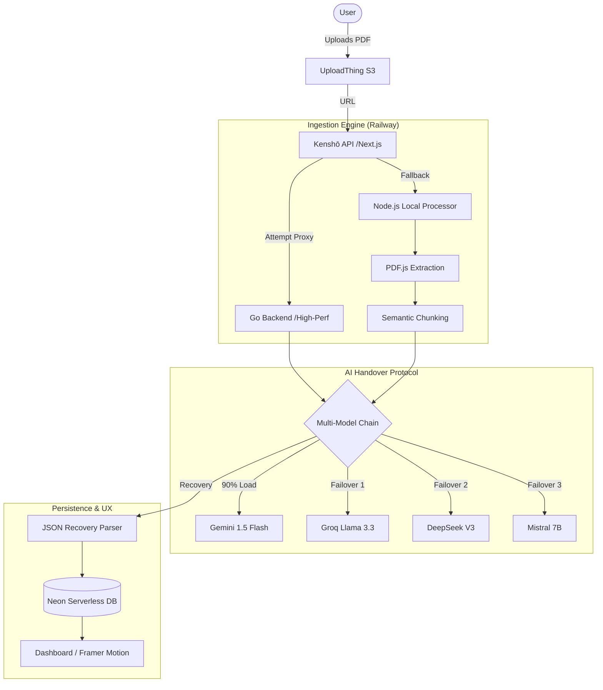

# Kenshō (見性) — The Intelligent Flashcard Engine

> **見性**: *A Japanese word meaning "seeing one's true nature."*

Kenshō is a high-fidelity workstation built for the **Cuemath AI Builder Challenge**. It transforms static PDF study materials into comprehensive, practice-ready flashcard decks using a resilient, multi-model AI pipeline and a human-centric spaced repetition system (SM-2).

## 🏮 The Inception
When presented with the three challenge problems, **The Flashcard Engine** resonated most with my background in UI/UX and Next.js development. I saw an opportunity not just to build a tool, but to solve the "Passive Reading" epidemic with an experience that prioritizes **Retention, Progress, and Delight.**

## 🏗️ Technical Architecture (The "Zero-Dollar" Stack)
Built on a student budget with a "Developer's Refusal to Accept Defeat," Kenshō uses a **Hybrid-Distributed** architecture to achieve production-grade performance for free.



### The Developer's Arsenal
- **The Brainstormer**: **Claude 3.5 Sonnet** (The soul of the project, used for architectural deep-dives and UI/UX philosophy).
- **The Workhorse**: **Gemini 1.5 Flash** (Handled 90% of the card generation due to high speed and generous free-tier limits).
- **The Speedsters**: **Llama 3.3 (Groq)** and **DeepSeek V3** (Used for high-speed failovers).
- **The Builder**: **Google Antigravity** (The AI agent used to execute the builds and maintain atomic version control).

---

## 🛠️ The Performance Pivot: Vercel vs. Railway

A major turning point in development was discovering the **Vercel 10-second "Death Clock."** 

- **The Failing**: Processing a 15-page PDF in a single serverless function caused frequent timeouts. 
- **The Refusal to Defeat**: Instead of cutting features, I migrated the "Kenshō Brain" to a **persistent Go-based backend on Railway**. This bypassed the timeout entirely, allowing for deep, multi-minute semantic analysis of large documents—all while staying within the free tier.

---

## 🚀 Key Features

### 1. Smart Extraction Logic
Kenshō respects your context. It adapts its reading based on the size of your material:
- **1-4 Pages**: Full-text analysis—respecting focused, high-density study material.
- **5-20 Pages**: Deep contextual sampling—extracting key themes and section introductions.
- **20+ Pages**: Smart-blocking to ensure AI quality remains high and "Great Teacher" outputs aren't diluted.
- **Page Selection**: A custom feature allowing users to "trim" their PDFs to specific chapters, saving tokens and time.

### 2. "Great Teacher" Ingestion
Unlike "shallow" generators, Kenshō identifies:
- Key concepts and definitions
- Inter-topic relationships
- Practical worked examples and edge cases

### 3. Human-Centric Scheduling
- **Natural Language**: Review dates are displayed as "Today", "Tomorrow", or "Yesterday".
- **Visual Urgency**: Overdue cards are automatically highlighted in red to prioritize the study backlog.
- **Progress Tracking**: Real-time mastery percentages and "Deck Health" scores.

---

## 🏁 Getting Started

### Environment Variables
```bash
NEXT_PUBLIC_CLERK_PUBLISHABLE_KEY=...
CLERK_SECRET_KEY=...
DATABASE_URL=...
UPLOADTHING_SECRET=...
GROQ_API_KEY=...
GEMINI_API_KEY=...
DEEPSEEK_API_KEY=...
HUGGING_FACE_API_KEY=...
KENSHO_BACKEND_URL=...
```

---

## 🏆 Project Mission
Kenshō was built for the **Cuemath Build Challenge** to prove that AI-driven education tools can be more than just automated scrapers—they can be high-fidelity partners that bring "Delight" back to learning. 

**Kenshō: See your true nature. Master your knowledge.**
