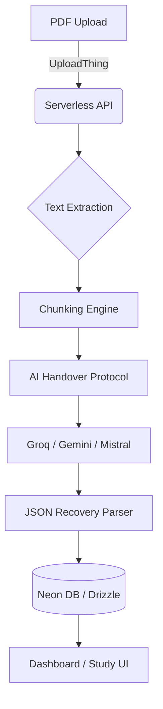

# Kenshō — The Intelligent Flashcard Engine

Kenshō is a high-fidelity web application built for the **Cuemath AI Builder Challenge**. It transforms static PDF study materials into comprehensive, practice-ready flashcard decks using a resilient, multi-model AI pipeline and a human-centric spaced repetition system.

## 🏗️ Architecture

Kenshō is built with a modern, serverless-first stack designed for high throughput and premium user experience.



### Tech Stack
- **Framework**: Next.js 15+ (App Router, Turbopack)
- **Auth**: Clerk (Native Modal Architecture)
- **Database**: Neon (Serverless PostgreSQL)
- **ORM**: Drizzle ORM
- **Styling**: Tailwind CSS 4, Framer Motion
- **Storage**: UploadThing
- **AD Intelligence**: Groq (Llama 3.3), Google Generative AI (Gemini 1.5), Mistral 7B (Inference)

---

## 🚀 Key Features

### 1. "Great Teacher" Ingestion
Unlike "shallow" generators, Kenshō uses a specific "Master Educator" prompting strategy. It doesn't just scrape text; it identifies:
- Key concepts and definitions
- Inter-topic relationships
- Practical worked examples
- Edge cases and common pitfalls

### 2. The AI Handover Protocol
To bypass the 10-second serverless timeout window on Vercel and handle API rate limits, Kenshō uses a custom **Multi-Model Handover Protocol**:
- **Chunking**: Large PDFs are split into semantic chunks.
- **Failover Chain**: The system attempts generation with **Groq** (for speed). If it fails or times out, it hands the chunk to **Gemini** or **Mistral** automatically.

### 3. Human-Centric Scheduling
Relative dates improve cognitive ease during study sessions.
- **Natural Language**: Review dates are displayed as "Today", "Tomorrow", or "Yesterday".
- **Absolute Clarity**: Future dates are standardized to a clean "Day Month Year" format (e.g., 12 May 2026).
- **Visual Urgency**: Overdue cards are automatically highlighted to prioritize the study backlog.

---

## 🛠️ Technical Retrospective: Failing vs. Fixing

A significant part of Kenshō’s development involved navigating the "messy reality" of deploying AI at scale.

### The Vercel Timeout Barrier
- **Failing**: Processing 50+ pages of PDF text in a single 10-second Vercel function window caused frequent timeouts.
- **Fixed**: Moved to a chunked-processing architecture where the client manages the state of the ingestion, allowing multiple short-lived API calls to build a massive deck progressively.

### The UI Over-Engineering Trap
- **Failing**: Early versions attempted to build a custom route-based settings system. This added URL complexity and felt "un-native" compared to the core auth flow.
- **Fixed**: Ripped out custom routing and re-integrated with the **Clerk-native modal architecture**. This ensured a "Zero-Overhead" feel where settings are instantly accessible without changing the application state.

### The PDF Parsing Dependency Conflict
- **Failing**: Certain heavy PDF libraries (like `pdf-lib` or native `canvas` dependencies) caused compilation errors in the serverless environment.
- **Fixed**: Abstracted the parsing logic to use lightweight, serverless-friendly libraries (`pdfjs-dist` and `pdf2json`) with specific build-time exclusions for problematic Node.js primitives.

---

## 🏁 Getting Started

### Environment Variables
Create a `.env.local` file with the following:

```bash
NEXT_PUBLIC_CLERK_PUBLISHABLE_KEY=...
CLERK_SECRET_KEY=...

DATABASE_URL=...

UPLOADTHING_SECRET=...
UPLOADTHING_APP_ID=...

GROQ_API_KEY=...
GEMINI_API_KEY=...
DEEPSEEK_API_KEY=...
HUGGING_FACE_API_KEY=...
```

### Installation
```bash
npm install
npm run dev
```

---

## 🏆 Project Mission
Kenshō was built for the **Cuemath Build Challenge** to prove that AI-driven education tools can be more than just "automated scrapers"—they can be high-fidelity partners that bring "Delight" back to the learning process.
