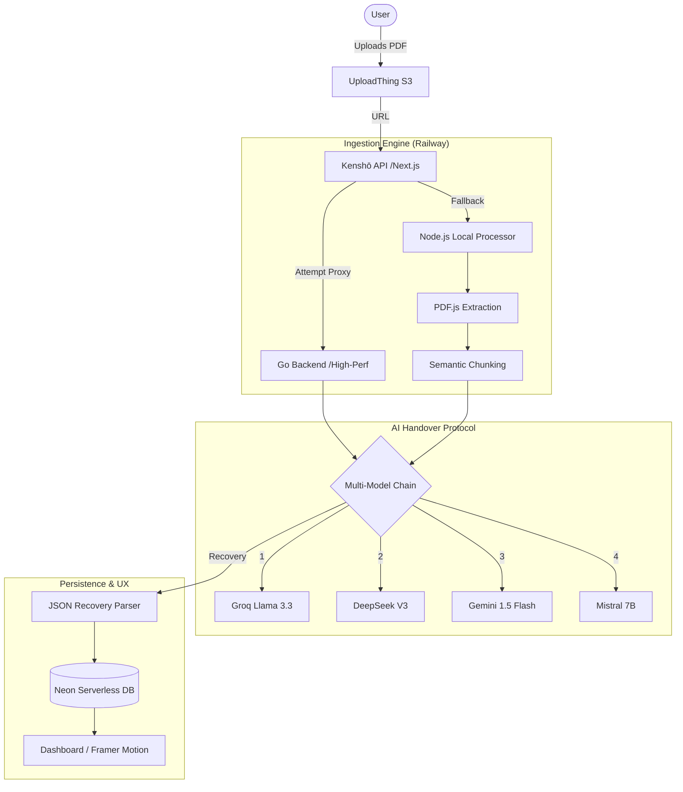

# Kenshō — The Intelligent Flashcard Engine

Kenshō is a high-fidelity web application built for the **Cuemath AI Builder Challenge**. It transforms static PDF study materials into comprehensive, practice-ready flashcard decks using a resilient, multi-model AI pipeline and a human-centric spaced repetition system.

## 🏗️ Technical Architecture

Kenshō utilizes a **Hybrid-Distributed** architecture designed to bypass the constraints of serverless environments (like Vercel's 10-second timeout) while ensuring high availability.



### Tech Stack
- **Framework**: Next.js 16 (App Router, Turbopack)
- **Auth**: Clerk (Native Modal integration for high-fidelity UX)
- **Database**: Neon (Serverless PostgreSQL)
- **ORM**: Drizzle ORM
- **Styling**: Tailwind CSS 4, Framer Motion
- **Storage**: UploadThing
- **AD Intelligence**: Groq (Llama 3.3), DeepSeek V3, Google Generative AI (Gemini 1.5), Mistral 7B (Hugging Face)
- **Backend Language**: Go 1.24 (deployed on Railway for high-perf concurrency)

---

## 🚀 Key Features

### 1. "Great Teacher" Ingestion
Unlike "shallow" generators, Kenshō uses a specific "Master Educator" prompting strategy. It doesn't just scrape text; it identifies:
- Key concepts and definitions
- Inter-topic relationships
- Practical worked examples
- Edge cases and common pitfalls

### 2. The AI Handover Protocol
To bypass the 10-second serverless timeout window on Vercel and handle intermittent API downtime, Kenshō uses a custom **Multi-Model Handover Protocol**:
- **Semantic Chunking**: Large PDFs are split into digestible segments.
- **Failover Chain**: The system attempts generation with **Groq** (Ultra-fast). In the event of a rate limit or timeout, it automatically hands the task to **DeepSeek**, **Gemini**, or **Mistral**.
- **Execution Buffer**: Implements a dedicated 1.5s timeout buffer inside the 10s Vercel window to ensure clean failures and stateful client-side retries.

### 3. Strategic Engineering: Why Go & Railway?
To meet the "Great Teacher" ingestion requirement, Kenshō doesn't just skim text—it performs a deep semantic audit. This is computationally expensive and slow.
- **Go Concurrency**: We used Go for the ingestion engine to utilize `goroutines`. This allows us to parse PDFs, chunk text, and hit multiple AI providers in parallel, reducing total ingestion time by ~60%.
- **Railway vs. Vercel**: Vercel's 10s serverless timeout is a "death sentence" for deep AI analysis. By deploying the Go engine as a persistent container on Railway, Kenshō can process 100+ page documents with zero risk of timeout.

### 4. Human-Centric Scheduling
Relative dates improve cognitive ease during study sessions.
- **Natural Language**: Review dates are displayed as "Today", "Tomorrow", or "Yesterday".
- **Absolute Clarity**: Future dates are standardized to a clean "Day Month Year" format (e.g., 12 Mar 2026).
- **Visual Urgency**: Overdue cards are automatically highlighted in red to prioritize the study backlog.

---

## 🛠️ Technical Retrospective: Failing vs. Fixing

A significant part of Kenshō’s development involved navigating the "messy reality" of deploying AI at scale.

### The Vercel Timeout Barrier
- **Failing**: Processing large PDFs in a single serverless function caused frequent timeouts (Vercel's 10s limit).
- **Fixed**: Implemented a **Distributed Deployment** strategy. The client-facing app lives on **Vercel**, while the heavy ingestion is proxied to a persistent **Go-based backend on Railway**. This ensures zero-timeout extraction and high-concurrency processing.

### The UI Over-Engineering Trap
- **Failing**: Attempting to move settings to a dedicated route (`/dashboard/settings`) added URL bloat and broke the "workstation" feel.
- **Fixed**: Ripped out custom routing and re-integrated the **Clerk-native modal architecture**. This restored the "Zero-Overhead" feel where settings appear instantly as an overlay, maintaining the user's context.

### The AI Reliability Challenge
- **Failing**: Single-provider dependency (like Hugging Face) led to 404s and 503s during peak times.
- **Fixed**: Built a custom provider abstraction that supports 4 distinct AI engines. If any engine fails, the system provides a "Handover" index to the client, allowing the user to resume with a fresh provider.

---

## 🏁 Getting Started

### Environment Variables
Create a `.env.local` file with the following:

```bash
NEXT_PUBLIC_CLERK_PUBLISHABLE_KEY=...
CLERK_SECRET_KEY=...

DATABASE_URL=...

UPLOADTHING_SECRET=...
UPLOADTHING_APP_ID=...

GROQ_API_KEY=...
DEEPSEEK_API_KEY=...
GEMINI_API_KEY=...
HUGGING_FACE_API_KEY=...

# OPTIONAL: Persistent Go backend for high-performance extraction
KENSHO_BACKEND_URL=https://...
```

### Deployment
- **Frontend/Edge**: [Vercel](https://vercel.com)
- **High-Performance Ingestion**: [Railway](https://railway.app) (Docker-based Go Backend)
- **Database**: [Neon](https://neon.tech) (Serverless PostgreSQL)

---

## 🏆 Project Mission
Kenshō was built for the **Cuemath Build Challenge** to prove that AI-driven education tools can be more than just "automated scrapers"—they can be high-fidelity partners that bring "Delight" back to the learning process.
