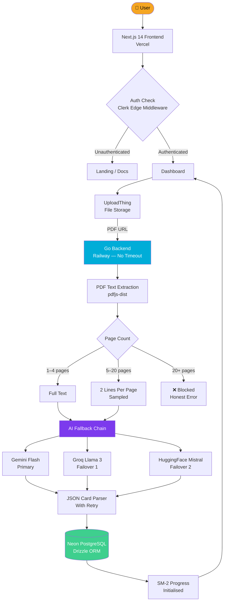
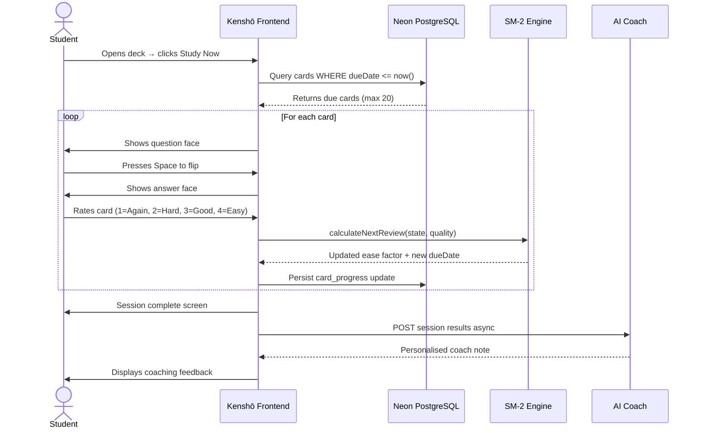
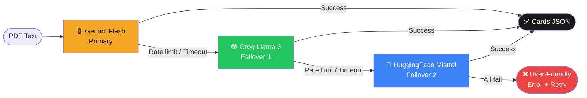
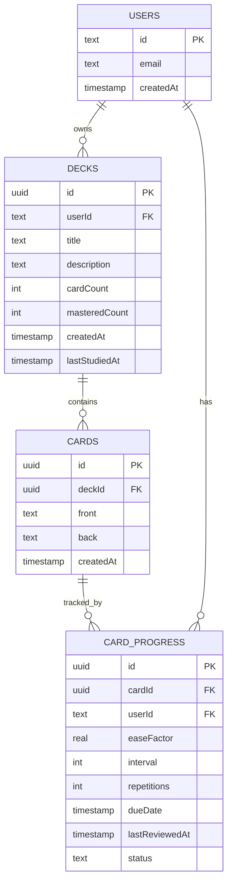

<div align="center">

# Kenshō (見性)

### *See through the noise.*

**An AI-powered spaced repetition engine that turns any PDF into a smart, practice-ready study deck.**

Built for the **Cuemath AI Builder Challenge** by **Harshal Patel**

<br/>

[](https://kensho-flashcard-engine.vercel-red.app)
[](https://github.com/HarshalPatel1972/kensho-flashcard-engine)
[](#)
[](https://nextjs.org)
[](https://typescriptlang.org)
[](https://go.dev)

<br/>

> 見性 — *Kenshō* is a Japanese term meaning "seeing one's true nature."  
> A sudden moment of clarity. That's what good studying feels like.

</div>

---

## What is Kenshō?

Most students re-read their notes the night before an exam. It feels productive. Cognitive science has known for decades that it doesn't work.

**What works:** being tested on what you know — repeatedly — at exactly the right time.

Kenshō automates that. Upload a PDF, select the pages you want to study, and the AI generates high-quality flashcards written like a great teacher made them. From there, the SM-2 algorithm takes over — showing you the right card at the right moment, tracking every interaction, and adapting to how your brain works.

It's not a flashcard app. It's a study system.

---

## Table of Contents

- [Demo](#demo)
- [Core Features](#core-features)
- [System Architecture](#system-architecture)
- [The Study Loop](#the-study-loop)
- [AI Pipeline](#ai-pipeline)
- [Tech Stack](#tech-stack)
- [Key Decisions & Tradeoffs](#key-decisions--tradeoffs)
- [Challenges I Hit](#challenges-i-hit)
- [Getting Started](#getting-started)
- [What I'd Improve](#what-id-improve-with-more-time)

---

## Demo

| Landing | Dashboard | Study Session |
|---------|-----------|---------------|
| Dark minimal hero with typewriter slogan | Deck grid with mastery progress | 3D card flip with SM-2 rating |

| Page Selector | AI Coach | Light Mode |
|---------------|----------|------------|
| Range input with PDF thumbnails | Post-session personalised coaching | Full light/dark toggle |

---

## Core Features

### 🧠 Intelligent Card Generation
Cards aren't scraped — they're crafted. The AI prompt instructs the model to generate cards like a great teacher would: covering key concepts, definitions, relationships, edge cases, and worked examples. Shallow cards are explicitly rejected by the prompt.

### 📄 Page-Level PDF Control
Instead of processing entire textbooks, users select exactly which pages to study. A range selector with live PDF thumbnails lets students target chapter 4 without touching chapters 1–10. This is both a UX decision and an engineering constraint — it keeps AI inputs small enough for free-tier models to handle reliably.

### 📐 Custom SM-2 Algorithm
Built from scratch in ~50 lines of TypeScript. No library. Each card has:
- **Ease Factor** (default 2.5) — how easy this card is for you
- **Interval** — days until next review
- **Repetitions** — successful review streak

After each rating (Again / Hard / Good / Easy), the algorithm recalculates when to show the card next. Cards you struggle with come back soon. Cards you've mastered fade to long intervals — freeing your attention for what needs work.

### 🤖 Post-Session AI Coach
After every study session, the AI analyses which cards you got wrong, finds patterns in your mistakes, and writes a personalised 2–3 sentence coaching note. Not generic praise. Specific, actionable feedback tied to your actual session results.

### ⚠️ Weak Cards Spotlight
The deck overview surfaces cards with ease factor below 2.0 — the ones your brain finds hardest — in a dedicated section before you study. You always know where your gaps are before the session starts.

### 🔍 Cross-Deck Search
Searches both deck titles and card content simultaneously using PostgreSQL ILIKE. Find any concept across your entire knowledge base.

### 🌗 Light & Dark Mode
System preference detection with manual toggle. Persisted across sessions. Because students study at all hours.

---

## System Architecture



---

## The Study Loop



---

## AI Pipeline

### Smart Extraction Logic

The amount of text sent to the AI is determined by how many pages the user selected. This is the honest solution to free-tier model limits.

```
Pages Selected     Extraction Method              Reason
─────────────────────────────────────────────────────────────
1 – 4 pages    →   Full text, no limit        User chose a focused doc
5 – 20 pages   →   First 2 lines per page     Context from every section
20+ pages      →   Hard block + clear message  Models can't handle it reliably
```

### Multi-Provider Fallback Chain



Every provider call has an 8-second timeout. If the response is empty or unparseable, the chain moves to the next provider. If all three fail, the user sees a human-readable message — never a raw error.

### The Card Generation Prompt

The prompt is the most important line of code in the entire app. It instructs the AI to write cards like a great teacher — not a bot.

```
You are a master educator creating high-quality flashcards from study material.

Rules:
- Cover key concepts, definitions, relationships, formulas, and important examples
- Front: a clear, specific question or prompt (not vague)
- Back: a concise but complete answer (1–3 sentences max)
- Do NOT create trivial or obvious cards
- Do NOT repeat the same concept with slightly different wording
- Include edge cases and nuanced distinctions where they exist
- Write as if a great teacher wrote these, not a bot

Return ONLY a JSON array with no markdown, no preamble:
[{"front": "...", "back": "..."}, ...]
```

---

## Tech Stack

### Frontend — Vercel
| Technology | Purpose |
|-----------|---------|
| Next.js 14 (App Router) | Framework |
| TypeScript | Type safety |
| Tailwind CSS | Styling |
| Framer Motion | Animations (3D flip, stagger, spring physics) |
| Clerk | Authentication — passwords never touch the DB |
| UploadThing | File uploads up to 2GB |
| Drizzle ORM | Type-safe DB queries |

### Backend — Railway (Go)
| Technology | Purpose |
|-----------|---------|
| Go (Golang) | PDF parsing + AI orchestration — no timeout limits |
| pdfjs-dist | Page-level text extraction |
| Gemini Flash | Primary card generation |
| Groq (Llama 3) | Failover 1 |
| HuggingFace (Mistral) | Failover 2 |

### Database
| Technology | Purpose |
|-----------|---------|
| Neon PostgreSQL | Serverless Postgres |
| Drizzle ORM | Schema + migrations |

### Why Go on Railway?

Vercel serverless functions have a **10-second execution limit** on the free tier. PDF parsing + AI generation reliably exceeds this. Migrating the processing layer to a persistent Go service on Railway (no timeout limit) solved this instantly — without adding cost.

---

## Database Schema



---

## Key Decisions & Tradeoffs

### Authentication — Clerk over rolling my own
Passwords never touch my database. Clerk handles bcrypt hashing, session tokens, breach detection, and brute force protection. My DB stores only the Clerk `userId` as a foreign key. Security by not storing what you don't need.

### Transactional card saves
Early versions saved cards incrementally during generation. Cancelling mid-way left orphaned cards in the database. The fix: generate everything first, write everything in a single DB transaction only on full success. If anything fails or is cancelled, the deck is deleted entirely. Cascade deletes handle the rest.

### Page selector over full-PDF processing
Processing an entire textbook is both technically unreliable (free model limits) and wrong for the user (they want chapter 4, not all 200 pages). The page range selector solves both problems simultaneously. It's the right product decision that also happens to solve the engineering constraint.

### SM-2 from scratch, not a library
The algorithm is ~50 lines of TypeScript. Writing it from scratch meant I understood every line — the ease factor adjustment formula, the interval multiplication, the mastery threshold. This understanding shaped the weak cards spotlight, the mastery calculation, and the coach prompt. Using a library would have hidden the mechanism.

### Honest error messages over silent failures
When the AI fails, users see: *"AI models are currently busy. Please wait 30 seconds and try again."* When a PDF is too large: *"This PDF has X pages. Current AI models cannot reliably process more than 20 pages."* Real information. Not "Something went wrong."

---

## Challenges I Hit

### The Vercel 10-Second Death Clock
The biggest architectural discovery of the project. Failures I was attributing to AI model unreliability were actually Vercel silently cancelling requests that exceeded the 10-second limit. The fix was moving the processing layer to Go on Railway — a persistent service with no timeout constraint.

### The PDF Upload Detour
First approach: Vercel Blob. Failed in implementation. Second approach: Gemini Files API. Rejected because it shared quota with the generation calls. Correct answer: UploadThing. Built specifically for Next.js, handles up to 2GB, no rate limit surprises. This cost several hours but taught me to be more skeptical of first solutions under time pressure.

### Cancel That Actually Cancels
AbortController cancels the client-side fetch. The server keeps running independently. The real fix: pass the abort signal through to the server AND make cancel a hard delete of the deck regardless of server state. The UI disables the cancel button during the brief cancellation window to prevent multiple delete calls.

### Free Models and Their Real Limits
Every AI provider documents generous limits. Real-world limits under shared infrastructure load are significantly lower. The honest solution: reduce input to what reliably works and set correct expectations in the UI. *"Cards are generated from the core concepts of your PDF"* is a feature description, not a disclaimer.

### Building With an AI Agent
This entire project was built using an AI agent inside Google's Antigravity IDE, with Claude for architecture and brainstorming. ~90% of the code was written by Gemini 3 Flash inside the agent. The workflow is fast — but it requires knowing exactly what you want and being able to identify when the agent is going in the wrong direction. The skill that mattered most wasn't coding. It was being precise about requirements.

---

## Getting Started

### Prerequisites
- Node.js 18+
- A Neon PostgreSQL database
- Clerk account (free)
- UploadThing account (free)
- At least one AI API key (Gemini free tier works)

### Environment Variables

```env
# Auth
NEXT_PUBLIC_CLERK_PUBLISHABLE_KEY=
CLERK_SECRET_KEY=

# Database
DATABASE_URL=

# File Upload
UPLOADTHING_SECRET=
UPLOADTHING_APP_ID=

# AI Providers (add as many as you have)
GEMINI_API_KEY=
GROQ_API_KEY=
HUGGINGFACE_API_KEY=

# Go Backend
KENSHO_BACKEND_URL=
```

### Setup

```bash
# Clone the repo
git clone https://github.com/HarshalPatel1972/kensho-flashcard-engine.git
cd kensho-flashcard-engine

# Install dependencies
npm install

# Push database schema
npx drizzle-kit push:pg

# Run locally
npm run dev
```

---

## What I'd Improve With More Time

**OCR for scanned PDFs** — The app currently blocks image-based PDFs with an honest message. The real fix is server-side OCR (Tesseract or a cloud API). Most Indian students have photographed textbook pages, not digital text files.

**Swipe gestures on mobile** — Swipe right = Easy, swipe left = Again. This is the natural touch interaction for flashcards and would make the mobile study experience feel native rather than adapted.

**Streak tracking and study reminders** — SM-2 is most powerful when used consistently. A daily streak counter and browser push notifications for due cards would meaningfully improve retention outcomes. The data is already in the DB.

**Deck sharing** — A read-only share link that lets someone copy a deck. This is how platforms like Quizlet built their growth — students study the same material together.

**Better page thumbnails** — The current thumbnails are functional. A proper implementation would render higher-resolution previews client-side so students can confirm they're selecting the right pages visually.

---

## Commit Philosophy

Every commit in this repository is atomic — one logical unit of work, one commit. The git log is readable as a project history.

```
chore: initialize Next.js 14 project with TypeScript and Tailwind
feat: create Neon DB schema with Drizzle ORM
feat: add SM-2 spaced repetition algorithm
feat: build PDF upload API route
feat: integrate Gemini Flash for card generation
feat: add flashcard 3D flip animation component
feat: implement study session with keyboard shortcuts
feat: add post-session AI coach note
feat: add cross-deck search by title and card content
feat: add weak cards spotlight to deck overview
feat: add light and dark mode with system preference detection
feat: add page selector with range input and thumbnail preview
fix: cancel button hard-deletes deck on first click
fix: transactional card saves — rollback on any failure
...
```

---

<div align="center">

**Built by Harshal Patel · Chandigarh University · April 2026**

*For the Cuemath AI Builder Challenge*

---

*"The illusion of knowing is the enemy of learning." — Feynman*

</div>
